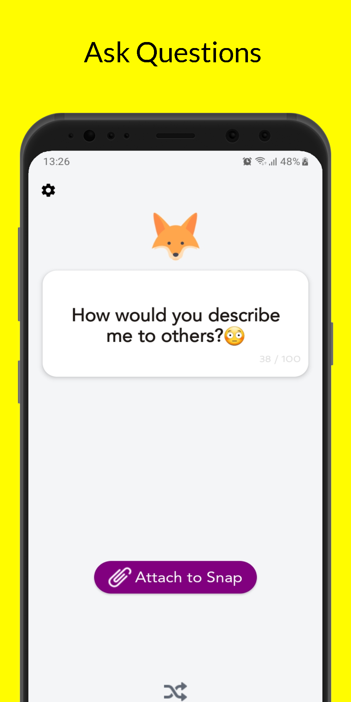
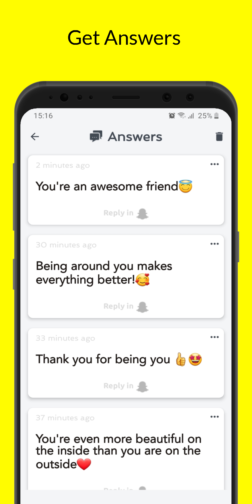
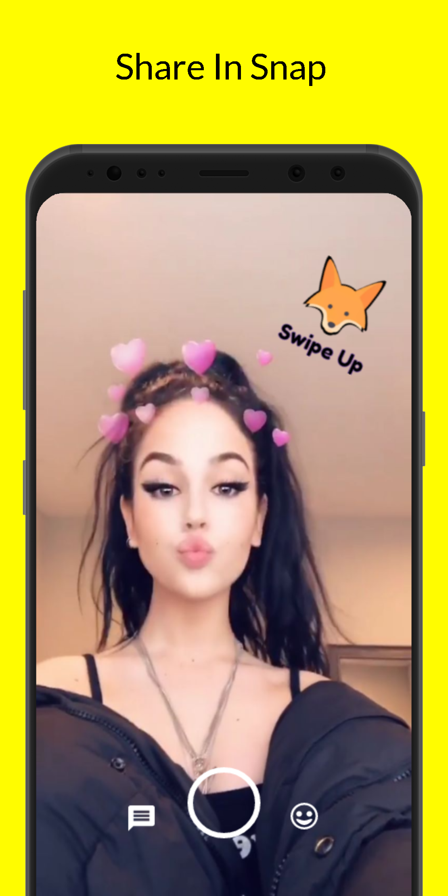
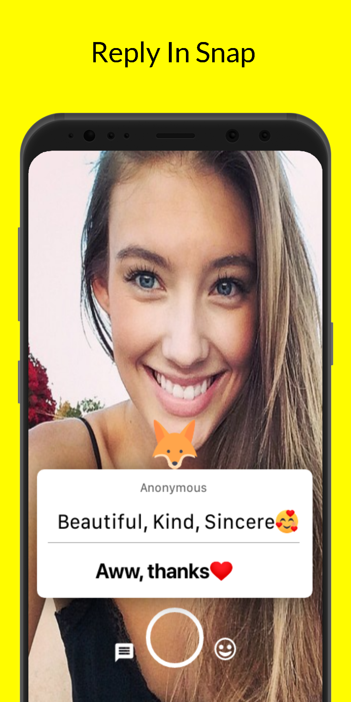

# TBH

TBH is an android app for Snapchat Q&A messaging like YOLO.

You will need to create dynamic link from Firebase and update code.

   

**** What you will need to do ****

    - Create a dynamic link and update manifest intent and dynamic link generation method code in MainActivity
    - Connect your app to Firebase either by assistant or by copying google-service.json
    - App uses Anonymous and Email authentication so you will need to activate them on console.
    - Open SnapKit account and copy/paste Development key to Manifest file. You will need to submit your account for to use in Production
    
 
